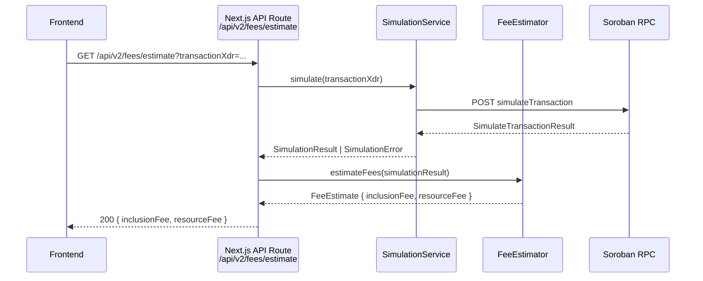

# Design Document: Gas-Estimate Oracle

## Overview

The Gas-Estimate Oracle is a Next.js API route (`GET /api/v2/fees/estimate`) that simulates a Soroban transaction via the Stellar RPC, applies a 10% safety buffer to the resource fee, and returns both the inclusion fee and buffered resource fee to the frontend. The implementation lives entirely in the Next.js `frontend/` application using TypeScript.

The flow is:
1. Frontend sends `GET /api/v2/fees/estimate?transactionXdr=<base64>`
2. API route calls the Simulation Service with the XDR
3. Simulation Service calls `simulateTransaction` on the Soroban RPC
4. Fee Estimator applies the 10% buffer to the resource fee increment
5. API route returns `{ inclusionFee, resourceFee }` in stroops

## Architecture



## Components and Interfaces

### SimulationService (`frontend/lib/simulation-service.ts`)

Wraps the Soroban RPC `simulateTransaction` JSON-RPC call.

```typescript
export interface SimulationSuccess {
  minResourceFee: string;       // raw stroop value as string (from RPC)
  sorobanData: string;          // base64 XDR SorobanTransactionData
  restoreFootprint?: object;    // present if state expiry detected
}

export interface SimulationError {
  kind: "rpc_error" | "network_error" | "malformed";
  message: string;
}

export type SimulationResult = SimulationSuccess | SimulationError;

export function isSimulationError(r: SimulationResult): r is SimulationError;

export async function simulate(
  transactionXdr: string,
  rpcUrl: string
): Promise<SimulationResult>;
```

The service sends a JSON-RPC 2.0 POST request:
```json
{
  "jsonrpc": "2.0",
  "id": 1,
  "method": "simulateTransaction",
  "params": { "transaction": "<transactionXdr>" }
}
```

### FeeEstimator (`frontend/lib/fee-estimator.ts`)

Applies the 10% safety buffer and extracts the inclusion fee.

```typescript
export interface FeeEstimate {
  inclusionFee: number;   // stroops, integer, no buffer
  resourceFee: number;    // stroops, integer, ceil(raw * 1.10)
}

export interface EstimationError {
  kind: "malformed_result";
  message: string;
}

export type EstimationResult = FeeEstimate | EstimationError;

export function isEstimationError(r: EstimationResult): r is EstimationError;

export function estimateFees(simulation: SimulationSuccess): EstimationResult;
```

Buffer formula:
```
resourceFee = Math.ceil(parseInt(minResourceFee, 10) * 1.10)
inclusionFee = parseInt(minResourceFee, 10)
```

> Note: The Soroban RPC `simulateTransaction` response returns `minResourceFee` as the total minimum fee covering both inclusion and resource costs. The resource fee increment (CPU/RAM) is embedded in the `sorobanData` XDR. For the purposes of this feature, `minResourceFee` is used as the base for both values: `inclusionFee` is the raw value, and `resourceFee` is the buffered value. This matches the Stellar SDK's `assembleTransaction` pattern.

### API Route (`frontend/app/api/v2/fees/estimate/route.ts`)

Next.js App Router route handler.

```typescript
export async function GET(request: Request): Promise<Response>
```

**Request**: `GET /api/v2/fees/estimate?transactionXdr=<base64-xdr>`

**Success Response (200)**:
```json
{
  "inclusionFee": 12345,
  "resourceFee": 13580
}
```

**Error Responses**:
| Status | Condition |
|--------|-----------|
| 400 | `transactionXdr` missing or empty |
| 422 | Simulation result is malformed |
| 502 | Soroban RPC error or network failure |
| 503 | `SOROBAN_RPC_URL` not configured (and no default fallback) |

## Data Models

### Soroban RPC Response Shape

The `simulateTransaction` RPC method returns:

```typescript
interface SorobanSimulateResponse {
  jsonrpc: "2.0";
  id: number;
  result?: {
    minResourceFee: string;       // stroops as decimal string
    sorobanData: string;          // base64 XDR
    results?: Array<{ xdr: string }>;
    restoreFootprint?: object;
    error?: string;               // present on simulation-level error
  };
  error?: {                       // present on RPC-level error
    code: number;
    message: string;
  };
}
```

### Fee Estimate Response

```typescript
interface FeeEstimateResponse {
  inclusionFee: number;   // integer stroops
  resourceFee: number;    // integer stroops (buffered)
}
```

### Error Response

```typescript
interface ErrorResponse {
  error: string;          // human-readable message
}
```

## Correctness Properties

*A property is a characteristic or behavior that should hold true across all valid executions of a system — essentially, a formal statement about what the system should do. Properties serve as the bridge between human-readable specifications and machine-verifiable correctness guarantees.*

Property 1: Resource fee is always >= inclusion fee
*For any* valid simulation result with a positive `minResourceFee`, the `resourceFee` returned by `estimateFees` should be greater than or equal to the `inclusionFee` (since the buffer only increases the value).
**Validates: Requirements 2.1, 2.3**

Property 2: Buffer is exactly 10% (ceiling)
*For any* non-negative integer raw resource fee `r`, `estimateFees` should return `resourceFee = Math.ceil(r * 1.10)`.
**Validates: Requirements 2.1, 2.3**

Property 3: Zero resource fee stays zero
*For any* simulation result where `minResourceFee` is `"0"`, `estimateFees` should return `resourceFee = 0`.
**Validates: Requirements 2.2**

Property 4: Inclusion fee equals raw minResourceFee
*For any* valid simulation result, `inclusionFee` should equal `parseInt(minResourceFee, 10)` with no modification.
**Validates: Requirements 2.4**

Property 5: Missing minResourceFee yields estimation error
*For any* simulation result object that lacks the `minResourceFee` field, `estimateFees` should return an `EstimationError` with `kind: "malformed_result"`.
**Validates: Requirements 2.5**

Property 6: API returns integer fee values
*For any* successful fee estimate response, both `inclusionFee` and `resourceFee` in the JSON body should be integers (no decimal component).
**Validates: Requirements 3.6**

## Error Handling

| Scenario | Component | HTTP Status | Log Level |
|----------|-----------|-------------|-----------|
| Missing `transactionXdr` param | API Route | 400 | warn |
| RPC network unreachable | SimulationService | 502 | error |
| RPC returns error field | SimulationService | 502 | error |
| `minResourceFee` missing | FeeEstimator | 422 | error |
| `SOROBAN_RPC_URL` not set | API Route | fallback to testnet | warn |

All error responses use the shape `{ "error": "<message>" }`. Stack traces are never serialized into responses.

Logging uses `console.error` / `console.warn` with the truncated XDR (first 64 chars) as context, compatible with Next.js server-side logging.

## Testing Strategy

### Unit Tests (Jest / Vitest)

- `FeeEstimator`: test buffer formula for representative values, zero input, and missing field
- `SimulationService`: mock `fetch` to test success path, RPC error path, and network failure path
- API Route: use Next.js `createMocks` or `Request`/`Response` constructors to test each HTTP status code path

### Property-Based Tests (fast-check)

Each property from the Correctness Properties section maps to one property-based test using [fast-check](https://github.com/dubzzz/fast-check) (already compatible with Jest/Vitest, no extra setup needed for TypeScript projects).

- Minimum 100 iterations per property test
- Tag format: `// Feature: gas-estimate-oracle, Property N: <property_text>`

**Property test targets**:
- Property 1 & 2: `fc.integer({ min: 1 })` → verify `resourceFee >= inclusionFee` and `resourceFee === Math.ceil(raw * 1.10)`
- Property 3: fixed input `"0"` → verify `resourceFee === 0` (edge case, single example)
- Property 4: `fc.integer({ min: 0 })` → verify `inclusionFee === raw`
- Property 5: `fc.record({})` (no `minResourceFee`) → verify error kind
- Property 6: `fc.integer({ min: 0 })` → verify `Number.isInteger(resourceFee) && Number.isInteger(inclusionFee)`

Properties 1, 2, 4, and 6 can be combined into a single comprehensive property test since they all operate on the same `estimateFees` function with valid integer inputs.
